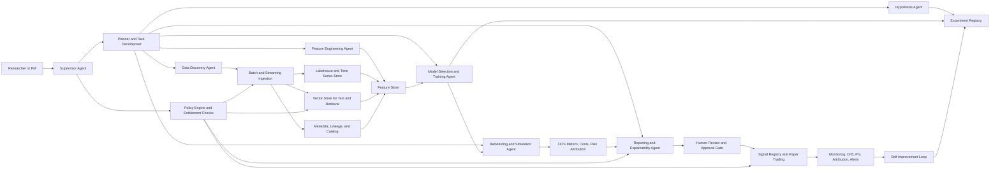

# Designing an Alpha Signal Research Agent

## Executive Summary

An effective **alpha signal research agent** for the financial industry should be designed first as a **research and evaluation system**, not as an autonomous trading system. The strongest pattern from recent financial-services agent deployments is that production systems are winning not because they are fully autonomous, but because they combine multi-agent decomposition, observability, evaluation, runtime guardrails, and human review in one operating loop. The prior overview of J.P. Morgan’s Ask DAVID, Bridgewater’s PAT, and Chime’s Jade points in the same direction: teams iterate from simpler agents to specialized graphs, rely on traces and evals as operational infrastructure, push governance into runtime, and keep humans in the loop for the final mile in high-stakes settings. fileciteturn0file0

For an alpha-research use case, the best target architecture is a **modular, production-ready research agent** with six hard boundaries: **official/primary data first; point-in-time storage and lineage; explicit experiment orchestration; cost-aware backtesting; explainability by construction; and policy-aware runtime controls**. The key objective is to compress the research cycle for signal ideation, feature creation, and model validation, while reducing avoidable errors such as leakage, backtest overfitting, entitlement violations, and undocumented model changes. That design choice is strongly aligned with supervisory expectations for robust model development, validation, governance, inventories, documentation, and “effective challenge.” citeturn9view0turn9view1turn32view2turn38view0

The most defensible starting point is to build for **equity-style research workflows first**, even if the long-run architecture is asset-class agnostic. Equities have the richest combination of official filings, standardized XBRL fundamentals, exchange-level market data, and mature academic evidence for ML-based return prediction. The same platform can then add fixed-income and crypto through source adapters and domain-specific labels. The SEC’s EDGAR and XBRL APIs, exchange direct-feed specifications, FINRA TRACE, official macro APIs, and blockchain node RPC interfaces make that possible without anchoring the first prototype on fragile third-party scraping. citeturn40view0turn39view1turn41view0turn41view1turn27view0turn32view0turn40view1turn32view3turn32view4

My central recommendation is therefore this: **build a production-ready agent before a self-improving autonomous one**. Use agentic methods to automate data discovery, hypothesis generation, feature construction, and experiment bookkeeping, but keep model approval, benchmark admission, and deployment gates under human control until the platform has earned trust through repeated out-of-sample performance, stable auditability, and strong control evidence. Bridgewater’s and Chime’s examples are instructive here: self-improvement and evaluator generation can be powerful, but they work because they are embedded in traceable workflows, benchmark discipline, and expert review rather than unconstrained autonomy. fileciteturn0file0

## Purpose and Scope

The purpose of an alpha signal research agent is to help researchers answer a recurring question faster and more rigorously: **“Is there a persistent, economically meaningful, tradeable signal here?”** In practice, that means the agent should support the end-to-end loop from **data discovery** to **hypothesis articulation**, **feature generation**, **model benchmarking**, **backtesting**, **risk attribution**, and **research memo generation**. It should not initially own order routing or execution. Keeping research separate from execution reduces operational and regulatory risk, and it aligns with the general principle that high-stakes model outputs require explicit review rather than unchecked agency. citeturn31view0turn9view0turn38view0

Unless an asset class is specified, the safest assumption is a **cross-asset platform with an equities-first implementation path**. The core abstractions should be invariant across markets: instruments, events, timestamps, features, labels, costs, regimes, and portfolios. What changes by asset class are the connectors and label definitions. For equities, that means SEC filings, exchange book and trade data, corporate actions, and issuer disclosures. For fixed income, that means TRACE-style transaction data, issuer disclosures, spread and curve state, and microstructure-aware execution assumptions. For crypto, that means venue trades and depth plus native on-chain state from node RPC interfaces. citeturn40view0turn41view0turn41view1turn27view0turn32view3turn32view4

The research agent should be optimized for **minutes-to-hours research latency**, not microsecond execution latency. That is a crucial design distinction. Alpha research needs breadth, reproducibility, and controlled experimentation; execution requires deterministic low-latency infrastructure and very different operational controls. Conflating the two tends to produce systems that are neither governable enough for research nor deterministic enough for execution. The prior overview reinforces this: production financial agents are moving toward longer-running, plan-based, multi-step workflows with pause/resume, approvals, and durable traces rather than one-shot copilots. fileciteturn0file0

A practical scope statement for version one would be:

*Research agent for idea generation, feature engineering, benchmarking, and paper-trade validation; equities-first; research-only outputs; no autonomous order placement; official and entitled data only; full experiment lineage required; human review required before promotion to paper trading or portfolio research distribution.* This scope is narrow enough to govern and broad enough to create real research leverage. citeturn9view0turn38view0turn31view0

## Core Architecture

The right architecture is a **supervisor-led, modular multi-agent system** over a point-in-time data platform. The supervisor decomposes work into specialists rather than trying to solve every task inside one giant context: a **data discovery agent**, **hypothesis agent**, **feature engineering agent**, **modeling agent**, **backtesting agent**, **evaluation agent**, and **reporting agent**. This mirrors what successful financial-services teams are already discovering in production: complexity is usually handled better by specialization, explicit planning, and traceable orchestration than by a single shallow tool-calling agent. fileciteturn0file0



The **data layer** should have four physically distinct stores. First, an **object-store or lakehouse** as the immutable source of truth for raw and normalized datasets. Second, a **time-series store** optimized for aligned panels, event joins, and point-in-time snapshots. Third, a **vector store** for retrieval over filings, transcripts, internal research, and news. Fourth, a **metadata and lineage store** that records dataset provenance, vendor entitlements, version IDs, label definitions, feature recipes, model artifacts, and approvals. This separation is what allows the platform to answer the key audit questions later: *Which data did the model see? Which transformations were applied? Was the data available at that time? Who approved the change?* Those questions map directly to model inventory, documentation, and validation expectations in SR 11-7 and to supervision/documentation expectations in FINRA Rule 3110. citeturn9view0turn38view0

The **agent capabilities** should be deliberately constrained:

Autonomous data discovery should mean discovering **entitled, cataloged, approved** datasets and assessing coverage, lag, revisions, frequency, and schema quality. It should not mean free-form internet crawling. Official APIs already expose much of what a research team needs: SEC filings and XBRL facts, FRED/ALFRED macro series and vintages, BEA national and regional accounts, BLS public data, NOAA climate data, Census data, USPTO data, TRACE, and blockchain node RPC methods. citeturn40view0turn39view1turn32view0turn40view1turn32view1turn23view0turn32view5turn33view3turn27view0turn32view3turn32view4

Hypothesis generation should operate more like a **disciplined research assistant** than a brainstorming chatbot. A strong hypothesis must specify: the economic mechanism, universe, horizon, rebalancing cadence, expected sign, likely failure regimes, and how the signal might survive costs. Bridgewater’s “the plan is the analysis” framing is especially relevant here: hypotheses become much more useful when converted into explicit data-frame requirements, joins, and testable evaluation plans. fileciteturn0file0

Feature creation should be partly symbolic and partly learned. The agent should generate candidate transforms, interaction terms, event windows, lag structures, and textual features, but every feature should compile into a deterministic recipe with unit tests, embargo-aware joins, and a declared point-in-time dependency graph. That “compiler” mindset is exactly the difference between an attractive demo and a repeatable research platform. fileciteturn0file0

### Example research workflows and prompts

A useful baseline workflow for **earnings-related equity signals** looks like this:

1. The data discovery agent monitors new 8-K, 10-Q, and 10-K submissions from EDGAR and issuer fundamentals from SEC XBRL APIs. citeturn40view0turn39view1  
2. The hypothesis agent proposes a mechanism, for example: *post-filing drift is stronger when management language and updated fundamentals jointly imply a revision in growth quality rather than headline revenue surprise*.  
3. The feature agent creates textual surprise, guidance-change, accrual-quality, liquidity, and volatility features.  
4. The modeling agent benchmarks linear, tree-based, and neural rankers.  
5. The backtesting agent runs walk-forward decile and long-short simulations with cost assumptions.  
6. The reporting agent produces a memo with OOS metrics, turnover, sector exposures, failure regimes, and a recommendation to discard, paper-trade, or escalate.

A sample **hypothesis-generation prompt**:

```text
You are an alpha research analyst operating under strict compliance constraints.

Task:
Generate 8 testable hypotheses for medium-horizon return prediction using only:
- SEC filings and XBRL fundamentals
- exchange market data
- approved macro series
- no customer data, no MNPI, no web crawling outside approved sources

For each hypothesis provide:
- economic mechanism
- asset universe
- horizon and rebalance frequency
- required datasets
- candidate feature families
- expected sign
- likely failure regime
- minimum viable backtest design
- transaction-cost sensitivity
- explainability requirements

Reject hypotheses that are:
- impossible to test point-in-time
- primarily data-mined
- likely to collapse under realistic trading costs
- dependent on non-entitled data
```

A sample **feature-engineering prompt**:

```text
You are a feature engineering agent for point-in-time financial research.

Input:
- universe: U.S. large and mid-cap equities
- objective: 21-trading-day cross-sectional return ranking
- approved sources: SEC submissions, SEC XBRL facts, exchange trades/quotes, FRED/ALFRED, BEA, BLS
- constraints: no look-ahead, no survivorship bias, explicit lag assumptions, deterministic recipes only

Produce:
- 20 candidate features grouped into price/volume, fundamentals, macro interaction, event, and text buckets
- formula or recipe for each feature
- required lag
- expected monotonicity
- missing-data handling
- leakage risks
- whether the feature is interpretable, semi-interpretable, or learned
- how to unit test point-in-time correctness
```

## Data Sources and Modeling Stack

The most robust data strategy is **primary and official first, normalized vendor data second, alternative data third**. For equities, start with **SEC EDGAR** for filings and **data.sec.gov** for submissions and XBRL facts. The SEC APIs expose company submissions and XBRL data in JSON, update throughout the day in real time, and publish nightly bulk files; EDGAR itself provides free access, daily and quarterly indexes, and clear fair-access rules. That combination makes SEC data a foundational source for both event studies and slower-moving fundamental research. citeturn40view0turn39view1

For market data, use the most direct source your budget and use case allow. The **NYSE Pillar Integrated Feed** provides real-time depth-of-book, last-sale, imbalance, status, and summary messages. **Nasdaq TotalView-ITCH** describes order adds, deletes, executions, directory information, and nanosecond timestamps since midnight. For fixed income, **TRACE** is the official FINRA-developed system for mandatory reporting of OTC transactions in eligible fixed-income securities. For crypto, the closest thing to primary data is direct **node RPC** and **JSON-RPC** access to chain state plus direct venue market data where contractually entitled. citeturn41view0turn41view1turn27view0turn32view3turn32view4

For macro and alternative data, prefer public official endpoints before buying commercial repackaging. **FRED** provides broad economic series, while **ALFRED** exposes vintages, which are critical for point-in-time macro backtests. **BEA** offers programmatic access to GDP, regional, industry, fixed-asset, and international datasets. **BLS** exposes public labor-market and price data APIs. **NOAA CDO**, **Census APIs**, and **USPTO open data** are useful examples of official non-market inputs that can feed sector- or theme-specific research hypotheses. citeturn32view0turn40view1turn32view1turn23view0turn32view5turn33view3

On the modeling side, the stack should be **tiered, not monolithic**.

Start with **classical statistics** as mandatory baselines: OLS, ridge, lasso, elastic net, logistic/probit for event classification, PCA and partial least squares for factor compression, Kalman/state-space models for latent-signal extraction, ARIMA or local projections for univariate structures, and cointegration/regime models where economically justified. These models are not optional just because more complex models exist; they are the control group that tells you whether complexity is buying anything real.

Then add **tabular ML**: random forests, gradient-boosted trees, and related ensembles. In empirical asset pricing, Gu, Kelly, and Xiu find large economic gains from ML forecasts and identify trees and neural networks as the best-performing families, with predictive gains coming largely from nonlinear interactions missing in simpler regressions. XGBoost remains a practical workhorse because it is scalable, strong on heterogeneous tabular features, and easy to benchmark. citeturn13view0turn36view4

Use **deep learning selectively**, not by default. The best financial applications are where structure clearly justifies it: multi-horizon forecasting with mixed covariates, dense limit-order-book prediction, or difficult text/event embeddings. Temporal Fusion Transformers are relevant when the target is multi-horizon and interpretability matters. N-BEATS is useful when fast, interpretable forecasting is needed. DeepLOB is the right reference archetype for high-frequency book data, not for ordinary medium-horizon cross-sectional alphas. citeturn37view0turn37view1turn36view3

Use **causal inference** when the research question is about mechanisms rather than prediction alone. If the agent is studying whether a policy change, rating action, index inclusion, or corporate event causes a return or spread response, methods like difference-in-differences, synthetic controls, instrumental variables, and double/debiased ML are more appropriate than pure predictive ranking. Double ML is especially relevant because it uses orthogonalization and cross-fitting to estimate causal parameters while reducing regularization bias. citeturn37view2

Use **Bayesian methods** where uncertainty itself is decision-relevant: signal shrinkage, hierarchical pooling across sectors or issuers, regime inference, and posterior over expected returns rather than point estimates alone. In production, Bayesian methods tend to be most valuable when they improve calibration, sample efficiency, or explicit uncertainty handling rather than as a blanket replacement for the rest of the stack.

For explainability, favor **model-specific transparency first**, then **post-hoc explainers**. Linear models should expose coefficient stability and sensitivity to sample windows. Tree ensembles should expose global and local importance, ideally with SHAP-style attribution. Deep models should be used when they earn their complexity, and their outputs should be wrapped with feature-selection traces, saliency, attention diagnostics, and counterfactual stress tests rather than treated as self-explanatory. SHAP remains a strong reference for consistent feature importance in nonlinear models. citeturn36view6

## Evaluation and Self-Improvement

A financial alpha agent lives or dies on **backtesting discipline**. The baseline methodology should be **walk-forward or expanding-window out-of-sample evaluation**, never random train/test splits. Every dataset used in training and evaluation must be **point-in-time reconstructed**, including fundamentals, macro revisions, symbol mappings, and delistings. FRED’s vintage data and SEC’s real-time plus nightly-republished dissemination patterns are practical reminders that “current data” and “data known at the time” are not the same thing. citeturn32view0turn40view0turn39view1

The agent’s validation harness should include four layers. First, **forecast metrics** such as OOS \(R^2\), rank information coefficient, hit rate, precision/recall for event labels, calibration, and error by regime. Second, **portfolio metrics** such as turnover, spread between top and bottom signal buckets, Sharpe, Sortino, drawdown, Calmar, exposure neutrality, capacity, and signal decay. Third, **trading realism** via commissions, spread crossing, borrow, market impact, venue constraints, and slippage assumptions. Fourth, **research integrity** via leakage checks, benchmark stability, and multiple-testing controls. The reason is simple: in finance, predictive accuracy is not the same thing as implementable alpha. citeturn13view0turn25view2

Backtest overfitting must be treated as a first-class failure mode. Bailey, Borwein, López de Prado, and Zhu argue that standard hold-out techniques are often unreliable in the context of investment backtests and propose the **Probability of Backtest Overfitting** using **combinatorially symmetric cross-validation**. In practice, that means the agent should record all tested strategies, estimate effective search breadth, and refuse to promote a signal simply because one configuration looked strong on a single path. citeturn25view2turn25view1

Self-improvement should begin with **evaluation-system improvement**, not with unfettered automated model deployment. The prior overview is especially useful here: both PAT and Jade improve by turning production traces and disagreements into benchmarks and evaluator refinements, not by silently rewriting live systems. Optuna is well-suited for controlled hyperparameter search and pruning, while River is more relevant once the platform legitimately needs streaming or continual learning. Meta-learning is a late-stage option for faster adaptation across related tasks, not a substitute for basic research hygiene. fileciteturn0file0 citeturn18view0turn36view5turn37view3

### Prioritized experiments for validating self-improvement

| Priority | Experiment | What to test | Success criteria | Core metrics |
|---|---|---|---|---|
| Highest | Benchmark mining from failed traces | Whether the agent can convert bad runs into durable regression tests | At least 70% of newly mined benchmarks reproduce the original failure and remain stable across two reruns | benchmark reproducibility, failure recapture rate, regression suite pass rate |
| High | Auto-tuning of retrieval and source ranking | Whether retrieval tuning improves answer correctness and data-source precision | Better source precision and answer faithfulness without increasing hallucination or latency beyond threshold | source precision, faithfulness, latency, citation coverage |
| High | Feature proposal agent with novelty and leakage filters | Whether agent-generated features outperform hand-written baselines net of costs | Improved OOS IC or Sharpe on a held-out regime with no rise in leakage incidents | OOS IC, net Sharpe, turnover, leakage alerts |
| High | Regime-aware model selector | Whether the agent can choose among linear, tree, and deep models based on problem structure and regime tags | Better median OOS performance than a single fixed model family across rolling windows | median OOS \(R^2\), regime-by-regime win rate, model-switch stability |
| Medium | Continual learning in paper trading only | Whether online updates improve adaptation without destabilizing behavior | Improved rolling paper-trade performance and no significant calibration collapse | rolling IC, calibration drift, alert count, rollback frequency |
| Medium | Human-feedback reward shaping | Whether expert thumbs-up/down improves ranking of future research outputs | Human satisfaction improves without increasing variance or policy breaches | reviewer preference rate, edit distance to final memo, compliance violation rate |
| Lower | Meta-learning across related universes | Whether shared initialization shortens training and improves cold-start performance | Faster convergence on new sectors/universes with equal or better OOS results | time-to-threshold, OOS IC, convergence variance |

The safest rollout rule is: **no self-improving behavior may directly change production paper-trading or live research distribution without passing the fixed benchmark suite, a held-out out-of-sample check, and a human approval gate**. That is where ambition stays compatible with model risk management. citeturn9view0turn31view0turn38view0

## Governance, Risk, Compliance, and Infrastructure

Governance for an alpha research agent should be built around **auditability, reproducibility, and constrained autonomy**. At minimum, every run should emit a trace containing the prompt context, data snapshot IDs, feature recipe hashes, model code version, hyperparameters, benchmark suite version, evaluator results, and reviewer approvals. SR 11-7 explicitly emphasizes robust development, validation, governance, documentation, model inventories, and effective challenge. FINRA Rule 3110 reinforces the need for written supervisory procedures, evidenced reviews, and preserved records. Those are not afterthoughts; they should define the system boundary from day one. citeturn9view0turn9view1turn38view0

Compliance-aware behavior should include at least five runtime controls. First, **identity-scoped entitlements** so the agent can only retrieve from sources the user may see. Bridgewater’s PAT design is the right mental model: access control should be a property of the agent context itself, not a polite instruction the model may forget. Second, **sensitive-data filtering and redaction** before content reaches the model or logs. Third, **human approval checkpoints** before promotion of new benchmarks, features, or models. Fourth, **spend and loop controls** to stop runaway retries and long-horizon agent loops. Fifth, **action-scope limits** so a research agent cannot place or modify orders. OWASP’s guidance on sensitive information disclosure, excessive agency, overreliance, prompt injection, and insecure output handling is highly relevant here. fileciteturn0file0 citeturn31view0turn32view2

Model privacy and data rights need their own explicit policy layer. An alpha agent will often touch licensed exchange data, entitled research, proprietary notes, or personal data in adjacent systems. The right default is **deny by default; retrieve only from approved connectors; log the source; and tag every output with provenance**. For alternative data, the research platform should also store contract metadata: who owns the data, what the field-level rights are, whether model training is allowed, and whether redistribution is prohibited. The agent should abstain whenever the rights are ambiguous.

Infrastructure should be chosen based on **research latency, data gravity, and utilization**. Cloud is usually the right starting point because storage and compute are elastic and paid on demand: S3 is explicitly pay-for-what-you-use object storage, and EC2 on-demand pricing converts fixed hardware commitments into variable costs. For deeper model training, AWS P5 instances provide up to 8 H100 GPUs and 640 GB of HBM3 memory; G6e instances are positioned as more cost-efficient for inference and smaller-scale training with up to 8 L40S GPUs and 384 GB total GPU memory. That makes a sensible split possible: CPU-heavy feature/backtest clusters on standard compute, L40S-class GPUs for inference and smaller experiments, and H100/H200-class GPUs only when needed for serious deep modeling. citeturn21view0turn22view3turn22view4turn22view1turn22view2

On-prem becomes attractive only when one of three conditions dominates: **steady high utilization**, **strict data-residency requirements**, or **tight coupling to proprietary low-latency market infrastructure**. Even then, I would still keep the logical design cloud-like: immutable storage, reproducible containers, declarative orchestration, and centralized metadata. The research agent should not depend on bespoke servers or manually curated analyst notebooks.

### Failure modes and mitigations

| Failure mode | Why it happens | Mitigation |
|---|---|---|
| Look-ahead leakage | Point-in-time violations in joins, fundamentals, or macro revisions | Versioned datasets, ALFRED/filing-time snapshots, embargo-aware joins, unit tests |
| Backtest overfitting | Too many correlated experiments and optimizer variants | Full trial logging, CSCV/PBO checks, benchmark admission policy, theory-first hypothesis filters |
| Entitlement or IP leakage | Agent retrieves from sources outside user rights | Identity-scoped agents, connector-level ACLs, provenance tags, deny-by-default retrieval |
| Sensitive-info disclosure | Prompts, logs, or outputs expose restricted content | Pre-model redaction, output filtering, log minimization, retention controls |
| Regime drift | Market structure changes faster than training assumptions | Drift monitors, rolling OOS checks, regime tags, paper-trading shadow phase |
| Hallucinated joins or bad schemas | Agent invents fields or mismatches identifiers | Typed data catalog, schema validation, join contracts, compiler-style feature recipes |
| Excessive agency | Agent takes actions beyond research scope | Separate research and execution planes, no order permissions, approval checkpoints |
| Over-complexity | Deep models beat baselines in-sample but cannot be defended | Mandatory linear/tree baselines, explainability tests, stability thresholds, model cards |
| Crowding and procyclicality | Many agents discover similar signals and reinforce flows | Capacity analysis, concentration limits, crowding monitors, human portfolio override |

The ethical and market-impact questions are real, even for internal research agents. A successful signal-discovery platform can increase **crowding**, reinforce **procyclicality**, and tempt firms into data practices that are legally allowed but socially questionable. Alternative-data use can also embed new privacy or fairness concerns. The best defense is governance by design: provenance, principle-based exclusions, explicit approval for sensitive datasets, and a review step for strategies that may scale into material market footprint. NIST’s AI RMF is useful here because it frames AI risk as organizational and societal, not only technical. citeturn32view2turn31view0

## Prototype Designs, Roadmap, and Limitations

### Comparison of three prototype designs

| Attribute | Lightweight research agent | Production-ready agent | Self-improving autonomous agent |
|---|---|---|---|
| Primary use | Rapid idea generation and benchmark comparisons | Reproducible research workflow with paper-trade handoff | Continuous improvement of research stack and benchmark suite |
| Data needs | Official/public data plus limited paid feeds | Official data plus normalized market/fundamental feeds and selected alternative data | Same as production-ready, plus richer trace corpus and evaluator telemetry |
| Compute | Mostly CPU; occasional small GPU | Medium CPU clusters plus targeted GPU usage | Larger CPU fleet, steady evaluator compute, optional continual-learning GPUs |
| Latency target | Minutes to hours | Minutes for ideation; hours for large backtests | Similar user latency, but continuous background jobs |
| Human oversight | High; analyst drives most steps | High at approval gates, lower within experiments | High for benchmark admission and production promotion; lower for background improvement |
| Expected ROI timeline | 3–9 months | 9–18 months | 18–36 months |
| Main risks | Toy backtests, shallow retrieval, poor discipline | Governance overhead, data-quality debt, hidden costs | Reward hacking, eval gaming, silent regressions, entitlement leakage |
| Compliance burden | Moderate | High | Very high |
| Cost estimate range | **$50k–$250k annually** | **$300k–$1.5M annually** | **$1.5M–$5M+ annually** |

Those ranges are **illustrative non-headcount annual platform/data/infra estimates**, not vendor quotes. Real totals vary widely with proprietary data licensing, horizon, breadth of universes, and whether high-end exchange or alternative data is in scope. The crucial planning point is that a self-improving architecture should be justified by clear evidence that the production-ready design has already created research leverage and can be governed. Cloud elasticity and modern GPU tiers make staged growth feasible; they do not remove the governance cost. citeturn21view0turn22view4turn22view1turn22view2turn9view0turn38view0

### Recommended implementation roadmap

**Phase one** should establish the data foundation: official-source ingestion, point-in-time storage, cataloging, identity/entitlement controls, and a minimal experiment registry. Deliverable: a reproducible research notebook-to-agent bridge with linear and tree baselines.

**Phase two** should add the agent layer: planner, data discovery, hypothesis generation, feature compiler, benchmark harness, and report generation. Deliverable: repeatable research runs that produce model cards and paper-trade recommendations.

**Phase three** should harden the evaluation stack: walk-forward backtests, realistic cost models, PBO-style checks, drift monitoring, and human review workflows. Deliverable: paper-trading signal registry with rollback and lineage.

**Phase four** should test self-improvement cautiously: mined benchmarks from failed traces, controlled hyperparameter search, evaluator refinement, and limited continual learning in paper trading only. Deliverable: measured improvement in benchmark coverage and OOS stability without increased policy incidents.

That phased path mirrors the practical lesson from the prior overview: successful teams do not jump directly to a grand autonomous architecture. They iterate, instrument, evaluate, and only then widen autonomy. fileciteturn0file0

### Recommended primary sources and seminal references

If I were curating the initial source pack for this project, I would prioritize these **primary data providers and official references**:

- **SEC EDGAR and XBRL APIs** for filings, submissions history, and standardized company facts. citeturn40view0turn39view1  
- **NYSE Pillar Integrated Feed** and **Nasdaq TotalView-ITCH** as archetypes for direct exchange-level book and trade data. citeturn41view0turn41view1  
- **FINRA TRACE** for fixed-income transaction reporting. citeturn27view0  
- **FRED/ALFRED**, **BEA**, and **BLS** for macroeconomic and vintage-aware official data. citeturn32view0turn40view1turn32view1  
- **NOAA**, **Census**, and **USPTO** for theme- or sector-specific official alternative data. citeturn23view0turn32view5turn33view3  
- **Bitcoin RPC** and **Ethereum JSON-RPC** for native on-chain state rather than third-party aggregates. citeturn32view3turn32view4  

For the **methods shelf**, the highest-value references are:

- **Gu, Kelly, Xiu** on empirical asset pricing via ML, because it remains one of the best empirical anchors for how ML changes return prediction and which model families matter. citeturn13view0  
- **Bailey, Borwein, López de Prado, Zhu** on the Probability of Backtest Overfitting, because search over many strategies is the agent’s natural failure mode. citeturn25view2  
- **Chernozhukov et al.** on Double/Debiased ML, for causal questions where prediction alone is not enough. citeturn37view2  
- **XGBoost**, for strong tabular baselines; **TFT** and **N-BEATS**, for interpretable time-series DL; **DeepLOB**, for order-book-specific deep architectures; **SHAP**, for post-hoc explanation of nonlinear models. citeturn36view4turn37view0turn37view1turn36view3turn36view6  
- **SR 11-7**, **NIST AI RMF**, **FINRA Rule 3110**, and **OWASP GenAI guidance** for governance and runtime controls. citeturn9view0turn32view2turn38view0turn31view0  

### Open questions and limitations

Two uncertainties remain important. First, the best architecture depends heavily on the intended **business model**: internal discretionary research, systematic portfolio research, selling-side analyst support, or client-facing advice each imply different controls and different latency budgets. Second, the right **data mix** can change costs by an order of magnitude; without a specified budget, the cost ranges here are planning estimates rather than procurement-grade budgets.

Even with those limitations, the design choice is clear: if the goal is a serious alpha signal research agent, the winning approach is **modular, point-in-time, evaluation-heavy, and governance-first**. Build the research operating system first. Let autonomy expand only after the evidence does.