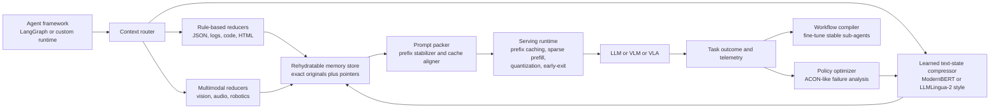
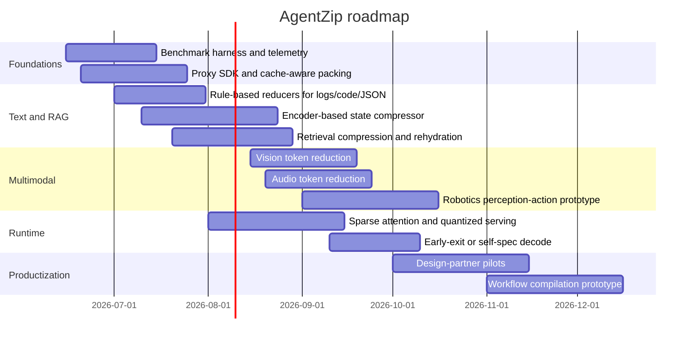

# Startup-Ready Final Project Proposal for Token-Efficient Multimodal Agents

## Executive summary

The strongest **CS336-scale, startup-ready project** in this space is not “just prompt compression.” It is a **multimodal token-efficiency runtime for agents**: a system that sits between an agent framework and the underlying LLM/VLM/VLA stack, and aggressively reduces the amount of text, image, audio, and action-state that must be processed **without materially hurting task success**. A good working name is **AgentZip**. Its job is to compress agent traces, tool outputs, retrieved documents, screenshots, audio streams, and robot observations; preserve exact originals for on-demand retrieval; stabilize prefixes for provider/server KV cache hits; and route requests into a serving stack that combines sparse attention, quantization, speculative decoding, and context-storage acceleration. This is a better project than a single-model paper reproduction because it captures the actual bottleneck in deployed agents: **context growth, repeated orchestration overhead, and multimodal token explosion**. citeturn37view0turn36view0turn34view0turn20view8turn20view10turn20view12

This proposal is especially compelling now because recent evidence points in the same direction from multiple angles. Long-horizon computer-use agents remain **painfully slow**, with LLM calls for planning and reflection accounting for most latency in OSWorld-style tasks, and top agents still taking substantially more steps than human trajectories. At the same time, long-context and multimodal models have improved enough that their bottleneck is often no longer “can the model reason?” but “how much context and KV state must be shipped, cached, and attended to?” Meanwhile, recent work such as **Compiling Agentic Workflows into LLM Weights** argues that external orchestration itself may be the wrong abstraction for some stable workflows, suggesting a roadmap where repeated procedures are eventually “compiled” into small specialized models. That gives the project a serious commercial endgame: start as a middleware efficiency layer, then move up the stack into **compiled agent substrate models** for high-volume workflows. citeturn36view0turn37view0turn20view2turn23view0turn20view12

My recommendation is to scope the project around a **hybrid system** rather than a single technique. The winning architecture combines: **rule-based content minimization** for structured artifacts like logs, JSON, and code; **encoder-based learned compression** for text/state using a ModernBERT- or LLMLingua-2-style token classifier; **retrieval-aware compression** using RECOMP/xRAG-like mechanisms; **multimodal token reduction** for vision/audio/robotics using FastV, ToMe, discrete speech tokenizers, and VLA token pruning; and **runtime efficiency** using prompt/prefix caching, sparse attention, quantization, and early-exit/self-speculative decoding. The result is ambitious enough for a professional ML engineer, yet modular enough to ship as a product. citeturn26view5turn27view0turn28view0turn29view0turn21view0turn20view7turn24view2turn35view0turn22view0turn20view8turn20view10turn20view11turn20view3turn31view1

## Problem and opportunity

The project’s problem statement is straightforward: **agent systems waste tokens everywhere**. Every turn repeats system instructions, tool schemas, previous thoughts, logs, stack traces, HTML/JSON responses, and retrieved evidence. This is bad enough for text-only agents, but it becomes severe for multimodal agents that ingest screenshots, audio, video, or robot observations. The multimodal token-compression survey notes that long-context MLLMs now process increasingly long image, video, and audio contexts, but pay substantial cost because of quadratic self-attention over many tokens. In practice, that means higher cloud bills, slower time-to-first-token, larger KV caches, and more distraction from irrelevant context. citeturn34view0turn20view2turn23view0turn32view0turn32view3

The opportunity is not just cost reduction. Compression can also **improve accuracy** by removing distractors. LongLLMLingua explicitly frames long-context prompting as a problem of higher cost, performance reduction, and position bias, and shows that selective compression can improve perceived salience of key information. ACON makes the same point for long-horizon agents: unbounded accumulation hurts both memory cost and reasoning quality, and optimized compression of observations and history can reduce peak token usage while improving task success. In other words, the project is not merely “make it cheaper”; it is “make agent memory actually usable.” citeturn28view1turn28view2

This fits unusually well with **CS336’s intellectual center of gravity**. Stanford CS336 now explicitly covers tokenization, resource accounting, architectures, attention alternatives, kernels, inference, evaluation, and multimodality. A project like AgentZip lets you tie all of those together: tokenizer design, encoder vs decoder tradeoffs, sparse attention, batching and packing, retrieval, evaluation, and systems measurements. It is exactly the kind of project that looks like a research prototype in a course and a startup substrate in the real world. citeturn19search0turn19search1

The startup angle is strong because there is already visible demand for practical context optimization. Headroom’s public materials position “context optimization for LLM agents” as a product category, routing different content types into specialized compressors and preserving originals for retrieval; its claims are vendor-published and should be treated as directional rather than independent proof, but they are still useful market evidence. More importantly, major providers now expose prompt caching or prefix caching in first-party systems, which is an admission that repetitive context has become a core production problem, not an academic curiosity. citeturn26view4turn26view5turn20view8turn20view9turn20view10

## Research landscape

The recent literature points to a useful taxonomy: **compress the content**, **compress the retrieval**, **compress the attention/KV path**, **compress the decoding path**, and **compress the modality itself**. The best proposal uses all five. citeturn34view0turn28view0turn29view0turn20view2turn20view3turn31view1

| Approach family | Representative work | Main benefit | Main weakness | Best role in this project |
|---|---|---|---|---|
| Text and state compression | Selective Context; LongLLMLingua; LLMLingua-2; ACON; ModernBERT citeturn28view3turn28view1turn28view0turn28view2turn27view0turn27view1 | Shrinks agent history, conversations, and tool outputs while often preserving or improving downstream performance | Can silently drop crucial edge-case details; some methods are still prompt- or task-sensitive | Core text/state compressor for traces, logs, and tool summaries |
| Retrieval-augmented compression | RECOMP; xRAG citeturn29view0turn21view0 | Replaces long retrieved docs with concise summaries or even embedding-bridge tokens | Requires careful faithfulness checks; embedding bridges are elegant but more specialized | RAG/document pipeline and long evidence handling |
| Sparse attention and KV reduction | MInference; Quest; SampleAttention; SparDA; MMInference citeturn20view2turn32view0turn32view3turn32view4turn23view0 | Reduces TTFT, prefill cost, and KV bandwidth for long contexts | Usually does not reduce *input tokens* at the application layer; integration can be model/runtime-specific | Serving-path acceleration after application-level compression |
| Early-exit and self-speculative decoding | LayerSkip; Draft & Verify; SWIFT; QuantSpec; early-exit inference frameworks citeturn20view3turn33view1turn33view3turn33view4turn33view0 | Lowers generation latency and memory without needing a separate draft model in some cases | Benefits vary by model and batching regime; acceptance-rate tuning matters | Response generation acceleration in the serving layer |
| Quantization | SmoothQuant; AWQ; SpinQuant; FP8 studies citeturn31view1turn31view0turn30view2turn30view3 | Reduces memory, power, and per-token cost; critical for edge and high-throughput serving | Accuracy cliffs remain real, especially for KV and activation quantization | Default deployment setting, especially for edge and lower-cost tiers |
| Learned tokenizers and discrete bottlenecks | BLT; Fast BLT; SpeechTokenizer; discrete speech-token work citeturn25view0turn24view1turn35view0turn35view2turn35view3 | Changes the unit of computation itself; promising for long-term efficiency and robustness | Larger architectural lift than middleware compression | Longer-term research track and moat-building layer |
| Vision, audio, and robotics token reduction | FastV; ToMe; TokenLearner; audio token pruning; DTP; FAST; SmolVLA citeturn20view7turn24view2turn24view3turn35view1turn22view0turn22view2turn21view1 | Cuts visual, acoustic, and action tokens before they hit the expensive generalist model | Cross-modal salience is brittle; real-world deployment needs careful safety checks | Multimodal differentiator and expansion path beyond text |

A few specific patterns matter for your design choices. **LLMLingua-2** reformulates prompt compression as a token-classification problem with a small encoder and reports 3x–6x faster compression than prior methods, plus end-to-end latency wins at 2x–5x compression. That makes the “encoder-based salience model” paradigm a better default than heavy causal-LM scorers. **ModernBERT** is a particularly attractive backbone for such a salience model because it was built for long context, speed, and memory efficiency, with alternating local-global attention and hardware-aware inference design. citeturn28view0turn27view0turn27view1

For retrieval, the contrast is interesting. **RECOMP** stays in language space, training extractive and abstractive compressors that prepend short summaries and can even emit an empty string when retrieval was irrelevant. **xRAG** goes further by treating retrieved document embeddings as a retrieval modality and bridging them into the language model with effectively extreme compression, down to one token while keeping retriever and LM frozen. For a startup product, that suggests a practical two-stage plan: start with textual summaries because they are easy to inspect and debug; then add embedding-bridge compression for high-volume verticals where faithfulness is well characterized. citeturn29view0turn29view1turn21view0

For multimodal systems, the current literature is increasingly favorable to **aggressive but selective pruning**. **FastV** shows the intuition that deep-layer visual attention is often inefficient and that large vision-language models can benefit from pruning visual tokens after the early layers. **ToMe** demonstrates that merging similar tokens can roughly double throughput in ViTs across images, video, and audio with modest quality loss. **TokenLearner** shows that a small number of adaptively learned tokens can preserve competitive results while reducing compute. On the robotics side, **DTP** and related VLA pruning papers show that task-irrelevant image regions can directly harm action generation, while **FAST** shows that better action tokenization matters for high-frequency control. These papers collectively argue that multimodal efficiency should be a first-class component, not an afterthought. citeturn20view7turn24view2turn24view3turn22view0turn22view2

Finally, the **systems literature** matters as much as the model literature. Provider-managed prompt caching depends on stable exact prefixes; OpenAI states this can substantially reduce cost and latency, and Anthropic exposes prompt caching around prompt prefixes as well. vLLM’s automatic prefix caching and disaggregated prefill make the same underlying point from the serving side: if you can stabilize prefixes, separate prefill from decode, and reuse KV intelligently, you can get large gains without changing the model’s semantics. This is why a “context optimizer” should also be a **prefix stabilizer** and **prompt packer**. citeturn20view8turn20view9turn20view10turn20view11

## Proposed project

The concrete proposal is **AgentZip: a multimodal context operating layer for agent workloads**. It has four technical pillars.

First, **content-aware application-level compression**. Use a router that classifies context chunks into code, logs, JSON/HTML, retrieved documents, conversational state, screenshots, audio chunks, and robot observations. Then apply the cheapest specialized reducer first: schema-aware minification for JSON; AST-aware code condensation; failure-preserving log compression; query-focused sentence extraction or abstractive compression for retrieved docs; and learned token classification for free-form text and long-running agent memory. This is directly inspired by the practical architecture Headroom publishes, but with more rigorous evaluation and stronger learned components. citeturn26view5turn28view0turn28view3turn29view0

Second, **rehydratable semantic memory**. Compression should never be “throw away and pray.” Every compressed artifact should live beside an exact original and an index that allows targeted re-expansion when the model asks for more detail or when uncertainty spikes. For textual evidence this can look like RECOMP-style extractive spans plus xRAG-style bridge vectors; for agent history it can look like ACON-style optimized summaries over observations and steps; for voice it can combine discrete speech tokens with timestamped chunk references; for screenshots it can keep the original image and send only reduced visual tokens or region summaries unless the task requires zoom-in. The key product insight is that **the LLM should see compressed context by default, but the system should be able to rehydrate losslessly on demand**. citeturn28view2turn29view0turn21view0turn35view0turn20view7

Third, **multimodal token shaping**. Do not convert everything to text if you can avoid it. For vision, use a FastV/ToMe-style reduction path and keep region pointers for follow-up inspection. For audio, use discrete speech tokenization or compact acoustic/semantic event tokens instead of full transcripts when the task needs prosody, interruption, or speaker-state information; WavBench and VoiceBench both show that plain text benchmarks miss essential spoken-dialogue properties. For robotics, compress both perception and action: visual token pruning for the observation path and FAST-like action tokenization for the control path. This is the area with the highest novelty and the biggest gap between research prototypes and product-quality systems. citeturn20view7turn24view2turn35view0turn35view1turn22view3turn22view4turn22view0turn22view2

Fourth, **runtime co-design**. The output of the context layer should be passed into a serving stack that is optimized for the remaining tokens. That means stable prefixes for prompt caching; packed prompts grouped by reusable prefixes; sparse prefill for long contexts; quantized weights/KV; and optional early-exit or self-speculative decode for generation. This matters because application-level token reduction and runtime-level compute reduction are multiplicative, not substitutes. Reducing context by 3x and per-token processing cost by another 1.5x is a very different business than doing only one of them. citeturn20view8turn20view10turn20view11turn20view2turn32view0turn32view3turn20view3turn33view3turn31view1

The most interesting long-term extension is the one suggested by **arXiv:2605.22502**: when a workflow is stable, frequently repeated, and mostly procedural, stop sending the procedure in the prompt at all. Distill or fine-tune a small “subterranean” model that has the workflow compiled into weights. That gives the project a clean strategic ladder: **compress the context today, then compile the most common contexts away tomorrow**. citeturn37view0

## Evaluation plan

The evaluation must look like an **agent systems paper**, not a compression paper in isolation. That means public workloads, end-to-end tasks, serving measurements, and fidelity checks. The right benchmark mix spans text-only agents, multimodal browser/desktop agents, voice assistants, and robotics. citeturn14search0turn20view5turn14search3turn36view0turn14search2turn14search4turn22view3turn22view4turn16search0turn21view1

| Workload class | Benchmark | Modality mix | Why it belongs |
|---|---|---|---|
| Web and tool-use agents | WebArena citeturn14search0 | Text, tool traces | Canonical web-agent environment with realistic multi-step browsing |
| Visual web agents | VisualWebArena citeturn20view5turn14search16 | Text plus screenshots | Direct test of visual-token reduction and screenshot compression |
| Computer-use agents | OSWorld and OSWorld-Human citeturn14search3turn36view0 | Screenshots, UI state, long-horizon planning | Best current benchmark family for latency-sensitive multimodal agents |
| Coding agents | SWE-bench citeturn14search2turn14search7 | Code, logs, diffs, issues | Ideal for code/log compression and rehydration |
| General assistants | GAIA citeturn14search4turn14search14 | Reasoning, web, multimodal/tool use | Good stress test for broad agent utility |
| Voice assistants | VoiceBench and WavBench citeturn22view3turn22view4 | Speech, conversational reasoning, paralinguistics | Essential if you claim non-text token efficiency |
| Robotics | LIBERO plus optional LIBERO-PRO or SmolVLA eval stack citeturn16search0turn16search4turn16search14turn21view1 | Vision, language, actions | Measures whether perception/action compression preserves control success |

The core metrics should include both **application-level token reduction** and **system-level latency/cost**. A serious study should at minimum report: input tokens sent to the main model; effective compression ratio; TTFT; inter-token latency; end-to-end task latency; GPU memory; cache-hit rate; retrieval tokens saved; task success; answer fidelity or faithfulness; hallucination/error rate; and the rate at which the system must rehydrate originals to recover from over-compression. For voice workloads, add response naturalness or paralinguistic adequacy; for robotics, add task success and control rate; for computer-use agents, add steps taken versus human-optimal baselines from OSWorld-Human. citeturn36view0turn22view3turn22view4turn16search0

| Metric | What it measures | Why it matters |
|---|---|---|
| Input token count | Tokens that reach the expensive model | Direct business lever for API cost and prefill time |
| Compression ratio | Original context size vs delivered context size | Normalizes results across workloads |
| TTFT | Time to first token | Critical for interactive agents and computer-use systems |
| End-to-end latency | Wall-clock task completion time | What customers actually feel |
| Cache-hit rate | Fraction of requests benefiting from prompt/prefix reuse | Validates prefix stabilization and packing strategy |
| GPU memory / KV footprint | Runtime memory cost | Important for long context, batching, and hardware tiering |
| Task success | Benchmark-native success metric | Ensures you did not just break the agent |
| Fidelity / faithfulness | Whether compressed context preserves answerable facts | Guards against silent failure |
| Hallucination / error rate | Failure induced by compression | Needed for enterprise trust and safety |
| Rehydration rate | How often the system had to request originals | Measures whether compression is too aggressive |

The baseline stack should be unusually thorough. Compare against **no compression**, **naive truncation**, **retrieval only**, **Selective Context**, **LongLLMLingua**, **LLMLingua-2**, **RECOMP**, **xRAG**, **ACON** for long-horizon state, and then systems-only baselines such as **prompt caching only**, **prefix caching only**, **sparse attention only**, **quantization only**, and **early-exit/self-speculative only**. The point is to show that hybrid application-plus-runtime optimization beats isolated tricks. citeturn28view3turn28view1turn28view0turn29view0turn21view0turn28view2turn20view8turn20view10turn20view2turn20view3turn31view1

A strong experiment set would look like this:

| Experiment | Hypothesis | Supporting prior evidence |
|---|---|---|
| Long-horizon browser agent on OSWorld | Hybrid compression can cut end-to-end latency materially without lowering task success, because planning/reflection dominate latency and context grows over steps | OSWorld-Human shows LLM planning/reflection dominate latency; ACON shows long-horizon compression can reduce peak tokens while improving success citeturn36view0turn28view2 |
| Coding agent on SWE-bench | Schema-aware log/code compression plus rehydration yields large token savings with little success loss | Headroom’s public design is built around logs/code/JSON; ModernBERT and LLMLingua-2 suggest fast encoder-style salience models are practical citeturn26view5turn27view0turn28view0 |
| RAG-heavy assistant on GAIA | RECOMP-style summaries or xRAG-style bridges beat raw prepending on cost, and sometimes on accuracy | RECOMP and xRAG both report substantial compression with strong downstream performance citeturn29view0turn21view0 |
| Visual web agent on VisualWebArena | Visual token reduction improves speed with minimal task loss, especially on screenshot-heavy tasks | FastV, ToMe, and TokenLearner all support this direction citeturn20view7turn24view2turn24view3 |
| Voice agent on VoiceBench and WavBench | Text-only summarization is insufficient; speech-aware discrete tokens and selective audio retention improve robustness | VoiceBench and WavBench were created precisely because clean-text evaluation misses real spoken interaction properties; discrete speech tokens are now a core paradigm citeturn22view3turn22view4turn35view0turn35view2 |
| Robot policy on LIBERO | Compression of visual tokens and action tokens can preserve or improve success by removing distractors and reducing bandwidth | DTP, FAST, and SmolVLA support efficient perception/action representations for VLAs citeturn22view0turn22view2turn21view1 |

The expected outcomes should be framed as **targets**, not promises. Based on the literature, it is realistic to aim for **2x–5x application-level compression** on long textual context, **meaningful latency reductions** from stable-prefix caching and sparse attention, and **modest or even positive task-quality changes** on distraction-prone long-horizon workloads. For multimodal tasks, the target should be **measurable latency wins with no statistically meaningful drop in success** on at least one web benchmark and one robotics or voice benchmark. The ambitious stretch goal is to show that the full stack reduces total task cost enough to enable a **smaller base model** to match or beat a larger unoptimized model on the same workload. That would be extremely compelling commercially. citeturn28view0turn28view1turn28view2turn20view2turn23view0turn20view8turn32view3turn21view1

## Systems architecture and hardware

The software architecture should be packaged as a **proxy-plus-SDK**. In practice, that means a drop-in front end for OpenAI-, Anthropic-, or vLLM-compatible clients, with optional framework integrations for LangGraph/CrewAI/custom runtimes. The proxy is important because it lets you intercept context uniformly, perform offline or asynchronous compression, collect telemetry, and deploy without rewriting every application. Headroom demonstrates the practical viability of this product shape, and provider/runtime caches make it even more natural. citeturn26view5turn20view8turn20view10

On the serving side, the lowest-friction setup is a conventional **GPU-backed inference runtime** with automatic prefix caching, prompt packing, quantized models, and optional sparse prefill. vLLM’s prefix caching and disaggregated prefill are directly relevant here, while SmoothQuant and AWQ are good first deployment defaults depending on model family and latency target. If you add self-speculative decoding or early exit, do it behind a flag and benchmark heavily, because batching interactions can change the outcome. citeturn20view10turn20view11turn31view1turn31view0turn33view0turn20view3

The hardware story gets interesting once you go beyond “one GPU box.” **BlueField-4 and NVIDIA CMX** are relevant not because you need them for a first prototype, but because they validate the architectural direction: KV cache and context memory are becoming first-class infrastructure tiers for long-context and agentic inference. Likewise, **KIOXIA AiSAQ** is evidence that SSD-native ANN retrieval is becoming viable for RAG, which matters if your system stores many compressed artifacts and embeddings. For edge and robotics, **Jetson Orin** is a natural platform for on-device tokenization, region proposal, speech compression, and privacy-preserving pre-processing. For deterministic low-latency pipelines, the **AMD Versal/Alveo** family makes FPGA-backed tokenization, light compression, or control-path acceleration plausible. citeturn20view12turn20view13turn18search0turn18search1turn18search2turn18search6

| Hardware option | Best use in AgentZip | Why it is attractive | Main downside |
|---|---|---|---|
| Standard CPU plus GPU server | Default training and serving path | Fastest path to product, easiest benchmarking, directly compatible with vLLM-style runtime optimizations citeturn20view10turn20view11turn31view1 | Least differentiated on infrastructure alone |
| Jetson AGX Orin | Edge pre-processing for voice, vision, robotics | NVIDIA positions it for generative AI, robotics, and vision at the edge; useful for on-device tokenizers and region/audio reducers citeturn18search0turn18search8 | Edge memory budget constrains model size |
| NVIDIA BlueField-4 plus CMX context tier | Shared KV/context layer for multi-agent deployments | NVIDIA explicitly markets CMX as a context-memory tier for long-context and agentic inference, extending effective GPU memory and improving throughput citeturn20view12turn12search0turn12search5 | New and enterprise-heavy; hard to access for small prototypes |
| NVMe/SSD ANN path such as AiSAQ | Low-DRAM retrieval and compressed memory lookup | Searches directly on SSDs for RAG, reducing DRAM dependence for large embedding stores citeturn20view13 | Primarily helps retrieval/path storage, not model compute directly |
| FPGA or adaptive SoC such as Alveo/Versal | Deterministic tokenization, quantized inference, robotics control loops | Strong latency and performance-per-watt positioning for real-time AI and embedded systems; relevant if you build a hardware-forward robotics variant citeturn18search1turn18search2turn18search6turn11search2 | Higher engineering burden and weaker software ecosystem than GPUs |

A practical “software plus hardware” project plan would therefore be: build the full runtime on normal GPU servers first; add a **Jetson sidecar** for local multimodal pre-processing if you want a flashy demo; and treat **BlueField/CMX or SSD-native retrieval** as design targets for the enterprise version, not as prerequisites for the research prototype. That sequencing is realistic and still ambitious. citeturn18search0turn20view12turn20view13

## Commercialization and roadmap

The clearest value proposition is: **make agent systems cheaper, faster, and more reliable by controlling what reaches the expensive model**. This is attractive to four customer groups. The first is **enterprise AI teams** building internal copilots and agents over noisy documents, logs, and tools. The second is **coding-agent and DevEx platforms**, where prompts are bloated by diffs, tests, stack traces, and tool chatter. The third is **voice-agent vendors**, where speech and paralinguistics are costly to process and simple transcription loses important signal. The fourth is **robotics and embodied-AI teams** that need efficient perception and action representations on constrained hardware. The common denominator is not “one model family”; it is **high-context agent workflows**. citeturn36view0turn22view3turn22view4turn21view1turn22view2

The best go-to-market is a **wedge-first strategy**. Start with **text-heavy, high-ROI workloads**—coding agents, browser agents, support agents, and RAG-heavy enterprise assistants—because public benchmarks exist and the integration surface is simple. Use open-source SDKs and a hosted eval dashboard to show token savings, latency deltas, and task-success neutrality on reproducible tasks. Once the telemetry and dataset moat grows, add multimodal modules for voice and vision; then selectively move into robotics or edge. Finally, for customers with heavily repeated procedures, offer workflow compilation into small specialized models, echoing the “compiled agent” direction from arXiv:2605.22502. citeturn14search2turn14search0turn14search4turn37view0

A reasonable pricing design would be **hybrid**: a platform fee for the proxy/evaluation/control plane plus usage-based pricing tied to compressed requests or a percentage of realized savings. The strategic reason to prefer that model is that early buyers will evaluate you on measurable before/after ROI, not on abstract “MLOps value.” Over time, the moat comes from three assets: a large corpus of agent traces paired with successful and failed compressions, modality-specific compressors, and workflow-compilation data for repeated procedures. Those are hard to replicate quickly. This paragraph is a recommendation rather than a sourced market fact.

Resource-wise, this is manageable for a small professional team because many of the most powerful components are **small encoders or runtime changes**, not giant foundation-model training runs. A plausible initial team is one ML systems engineer, one multimodal/compression researcher, one infra engineer, and one product-minded engineer who owns evals and integrations. Most training can be done on compact encoders and specialist modules; expensive GPU time is primarily needed for benchmark execution and serving comparisons, not for pretraining a frontier model from scratch. This paragraph is an engineering estimate rather than a sourced claim.

If you want a single-sentence investment thesis: **AgentZip becomes the “context plane” for agents today, and the “compiled workflow substrate” tomorrow**. That is a credible startup arc because it begins with immediate measurable cost savings and ends with proprietary small models for repeated enterprise procedures. citeturn37view0turn20view8turn20view12

## Open questions and limitations

Several of the most exciting papers in this space are **very recent**, including work from 2025 and 2026 on compiled agents, multimodal compression surveys, long-horizon compression, robotics token pruning, and sparse attention. They are credible primary sources, but not all have broad independent reproduction yet. A proposal should therefore distinguish clearly between **shipping modules now**—for example LLMLingua-2-style text compression, RECOMP-style RAG summaries, prompt/prefix caching, quantization—and **research bets** such as aggressive multimodal pruning policies or workflow compilation into weights. citeturn37view0turn34view0turn28view2turn22view0turn32view4

The second limitation is that “token efficiency” is not a single scalar target. Some methods reduce prompt tokens but not compute, others reduce compute but not application-level context, and still others change the unit of representation entirely. Your project should therefore avoid over-claiming a single universal compression score and instead report a matrix of savings: prompt tokens, KV footprint, TTFT, end-to-end task time, and success/fidelity. The literature strongly supports this more nuanced view. citeturn28view1turn20view2turn20view3turn31view1turn34view0

The third limitation is organizational rather than scientific: some hardware-forward enterprise directions, especially CMX/BlueField-style context tiers, are exciting but may be inaccessible for a course-scale prototype. That is acceptable. The startup-ready version of the proposal should treat those as **architecture-aligned optional accelerators**, not as dependencies. A high-quality software-first implementation would still be a very strong final project. citeturn20view12turn20view13turn18search0

The bottom line is that the best ambitious final project is **not a benchmark wrapper, not a thin prompt compressor, and not a one-off systems tweak**. It is a **multimodal context-efficiency platform** that attacks the real bottleneck of agent workloads from the content layer down to the hardware path, with a clear commercialization route and a credible research contribution. On both technical depth and startup potential, that is the idea I would pick. citeturn36view0turn37view0turn34view0turn20view8turn20view12